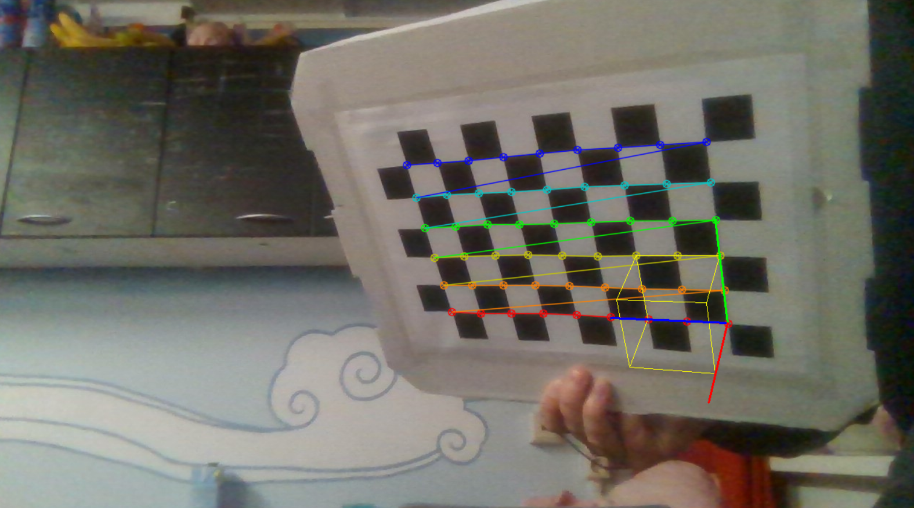

# Camera Calibration
This repository calibrates the intrinsic parameters of a camera by looping over an image folder containing images of a 9x5 chessboard. The program returns a test image with 3D cube and axes drawn from world origin.
- Optional: enable real-time cube detection on computer webcam

## Usage
- For execution run `main.py`. Make sure to insert `img_name` and `calibrate` and `live` to True if required
- If you want to calibrate your own camera intrinsics, replace images in `Images` with pictures of your own chessboard and set `calibrate=True`
- If you want to enable real-time cube detection, set `live=True`. Exit by pressing `q`

## Further
- The code also contains a function that produces a 3D plot with the locations of the camera relative to the chessboard for each
of the training images. This code is currently not in use but available in `main.py`

